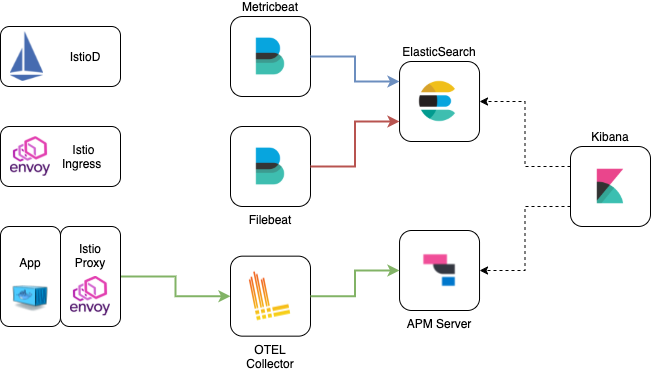

# Elastic Stack Helm Chart

[](https://opensource.org/licenses/Apache-2.0)
[](https://artifacthub.io/packages/search?repo=grafana)

The code is provided as-is with no warranties.

This Helm Chart contains the following components to monitor an Istio Cluster.




|Component|Helm Repo|Version|
|---------|--------|-------|
|Elasticsearch|[elasticsearch](https://helm.elastic.co)|7.15.0|
|Kibana|[kibana](https://helm.elastic.co)|7.15.0|
|APM Server|[apm-server](https://helm.elastic.co)|7.15.0|
|Filebeat|[filebeat](https://helm.elastic.co)|7.15.0|
|Metricbeat|[metricbeat](https://helm.elastic.co)|7.15.0|
|Logstash|[logstash](https://helm.elastic.co)|7.15.0|
|Open Telemetry|[opentelemetry-collector](https://open-telemetry.github.io/opentelemetry-helm-charts)|0.6.0|

## Usage

[Helm](https://helm.sh) must be installed to use the charts.
Please refer to Helm's [documentation](https://helm.sh/docs/) to get started.

Once Helm is set up properly, add the repo as follows:

```console
# helm repo add aspenmesh https://aspenmesh.github.io/helm-charts
```

You can then run `helm search repo aspenmesh` to see the charts.

```console
# helm search repo aspenmesh/elastic-stack

NAME                    CHART VERSION   APP VERSION     DESCRIPTION                                       
aspenmesh/elastic-stack	0.2.0        	1.11.3     	A Helm chart for Istio Monitoring with Elastic ...
```

# Example

This is an example of a clean istio install with IstioOperator and how to link it to the grafana monitoring stack deployed in the `monitoring` namespace.

```console
# istioctl operator init

# kubectl apply -f - <<EOF
apiVersion: install.istio.io/v1alpha1
kind: IstioOperator
metadata:
  namespace: istio-system
  name: istiocontrolplane-grafana
spec:
  components: 
    egressGateways: 
    - enabled: true
    ingressGateways: 
    - enabled: true
    pilot:
      enabled: true
  meshConfig:
    accessLogFile: /dev/stdout
    accessLogFormat: |
      [%START_TIME%] "%REQ(:METHOD)% %REQ(X-ENVOY-ORIGINAL-PATH?:PATH)% %PROTOCOL%" %RESPONSE_CODE% %RESPONSE_FLAGS% %RESPONSE_CODE_DETAILS% %CONNECTION_TERMINATION_DETAILS% "%UPSTREAM_TRANSPORT_FAILURE_REASON%" %BYTES_RECEIVED% %BYTES_SENT% %DURATION% %RESP(X-ENVOY-UPSTREAM-SERVICE-TIME)% "%REQ(X-FORWARDED-FOR)%" "%REQ(USER-AGENT)%" "%REQ(X-REQUEST-ID)%" "%REQ(:AUTHORITY)%" "%UPSTREAM_HOST%" %UPSTREAM_CLUSTER% %UPSTREAM_LOCAL_ADDRESS% %DOWNSTREAM_LOCAL_ADDRESS% %DOWNSTREAM_REMOTE_ADDRESS% %REQUESTED_SERVER_NAME% %ROUTE_NAME% traceID=%REQ(x-b3-traceid)%
    enableTracing: true
    defaultConfig:
      tracing:
        sampling: 100
        max_path_tag_length: 99999
        zipkin:
          address: otel-collector.monitoring:9411
  profile: default
EOF

# kubectl create namespace monitoring

# helm install elastic-stack aspenmesh/elastic-stack --namespace monitoring

```

This should result in the following components being installed.

```console
# kubectl get po,svc -n monitoring

NAME                                                    READY   STATUS    RESTARTS   AGE
pod/apm-server-6c88c699c6-pn8vp                         1/1     Running   0          40h
pod/elasticsearch-master-0                              1/1     Running   0          40h
pod/elasticsearch-master-1                              1/1     Running   0          40h
pod/elasticsearch-master-2                              1/1     Running   0          40h
pod/filebeat-52cwj                                      1/1     Running   0          40h
pod/filebeat-8mxjn                                      1/1     Running   0          40h
pod/filebeat-bs2xr                                      1/1     Running   0          40h
pod/filebeat-z6zc7                                      1/1     Running   0          40h
pod/filebeat-zshwr                                      1/1     Running   0          40h
pod/kibana-97c49776b-5d2bn                              1/1     Running   0          40h
pod/kube-state-metrics-7b9cd54d9c-d4gch                 1/1     Running   0          40h
pod/metricbeat-94gkh                                    1/1     Running   0          40h
pod/metricbeat-d9xlq                                    1/1     Running   0          40h
pod/metricbeat-h42l8                                    1/1     Running   0          40h
pod/metricbeat-metrics-8645d4649b-8xvjg                 1/1     Running   0          40h
pod/metricbeat-vv88k                                    1/1     Running   0          40h
pod/metricbeat-xrtj2                                    1/1     Running   0          40h
pod/otel-collector-6548484968-4gz89                     1/1     Running   0          40h

NAME                                       TYPE           CLUSTER-IP       EXTERNAL-IP                                                               PORT(S)                                 AGE
service/apm-server                         LoadBalancer   172.20.212.128   aaa.elb.amazonaws.com   8200:30236/TCP                          3m4s
service/kube-state-metrics                 ClusterIP      172.20.120.145   <none>                                                                    8080/TCP                                3m4s
service/elasticsearch-master               LoadBalancer   172.20.238.199   bbb.eu-west-1.elb.amazonaws.com     9200:31777/TCP,9300:32677/TCP           3m4s
service/elasticsearch-master-headless      ClusterIP      None             <none>                                                                    9200/TCP,9300/TCP                       3m4s
service/kibana                             LoadBalancer   172.20.45.172    ccc.eu-west-1.elb.amazonaws.com     5601:32756/TCP                          3m4s
service/otel-collector                     ClusterIP      172.20.238.203   <none>                                                                    14250/TCP,14268/TCP,4317/TCP,9411/TCP   3m4s
```

## License

<!-- Keep full URL links to repo files because this README syncs from main to gh-pages.  -->
[Apache 2.0 License](https://github.com/aspenmesh/helm-charts/blob/main/LICENSE).