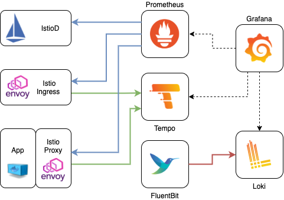

# Grafana Stack Helm Chart

[](https://opensource.org/licenses/Apache-2.0)
[](https://artifacthub.io/packages/search?repo=grafana)

The code is provided as-is with no warranties.

This Helm Chart contains the following components to monitor an Istio Cluster.




|Component|Helm Repo|Version|
|---------|--------|-------|
|Prometheus|[prometheus-community](https://prometheus-community.github.io/helm-charts)|14.9.1|
|Grafana|[grafana](https://grafana.github.io/helm-charts)|6.16.13|
|Tempo|[tempo](https://grafana.github.io/helm-charts)|0.7.7|
|Loki|[loki](https://grafana.github.io/helm-charts)|2.6.0|
|FluentBit|[fluent-bit](https://fluent.github.io/helm-charts)|0.19.1|

## Usage

[Helm](https://helm.sh) must be installed to use the charts.
Please refer to Helm's [documentation](https://helm.sh/docs/) to get started.

Once Helm is set up properly, add the repo as follows:

```console
# helm repo add aspenmesh https://aspenmesh.github.io/helm-charts
```

You can then run `helm search repo aspenmesh` to see the charts.

```console
# helm search repo aspenmesh/grafana-stack

NAME                    CHART VERSION   APP VERSION     DESCRIPTION                                       
aspenmesh/grafana-stack 0.12.0          1.11.3          A Helm chart for Istio Monitoring with Promethe
```

# Example

This is an example of a clean istio install with IstioOperator and how to link it to the grafana monitoring stack deployed in the `monitoring` namespace.

```console
# istioctl operator init

# kubectl apply -f - <<EOF
apiVersion: install.istio.io/v1alpha1
kind: IstioOperator
metadata:
  namespace: istio-system
  name: istiocontrolplane-grafana
spec:
  components: 
    egressGateways: 
    - enabled: true
    ingressGateways: 
    - enabled: true
    pilot:
      enabled: true
  meshConfig:
    accessLogFile: /dev/stdout
    accessLogFormat: |
      [%START_TIME%] "%REQ(:METHOD)% %REQ(X-ENVOY-ORIGINAL-PATH?:PATH)% %PROTOCOL%" %RESPONSE_CODE% %RESPONSE_FLAGS% %RESPONSE_CODE_DETAILS% %CONNECTION_TERMINATION_DETAILS% "%UPSTREAM_TRANSPORT_FAILURE_REASON%" %BYTES_RECEIVED% %BYTES_SENT% %DURATION% %RESP(X-ENVOY-UPSTREAM-SERVICE-TIME)% "%REQ(X-FORWARDED-FOR)%" "%REQ(USER-AGENT)%" "%REQ(X-REQUEST-ID)%" "%REQ(:AUTHORITY)%" "%UPSTREAM_HOST%" %UPSTREAM_CLUSTER% %UPSTREAM_LOCAL_ADDRESS% %DOWNSTREAM_LOCAL_ADDRESS% %DOWNSTREAM_REMOTE_ADDRESS% %REQUESTED_SERVER_NAME% %ROUTE_NAME% traceID=%REQ(x-b3-traceid)%
    enableTracing: true
    defaultConfig:
      tracing:
        sampling: 100
        max_path_tag_length: 99999
        zipkin:
          address: tempo.monitoring:9411
  profile: default
EOF

# kubectl create namespace monitoring

# helm install grafana-stack aspenmesh/grafana-stack --namespace monitoring
  
```


## License

<!-- Keep full URL links to repo files because this README syncs from main to gh-pages.  -->
[Apache 2.0 License](https://github.com/aspenmesh/helm-charts/blob/main/LICENSE).