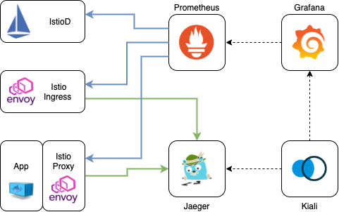

# Kiali Stack Helm Chart

[](https://opensource.org/licenses/Apache-2.0)
[](https://artifacthub.io/packages/search?repo=grafana)

The code is provided as-is with no warranties.

This Helm Chart contains the following components to monitor an Istio Cluster.




|Component|Helm Repo|Version|
|---------|--------|-------|
|Prometheus|[prometheus-community](https://prometheus-community.github.io/helm-charts)|14.9.1|
|Grafana|[grafana](https://grafana.github.io/helm-charts)|6.16.13|
|Jaeger|[jaeger](https://jaegertracing.github.io/helm-charts)|0.47.0|
|Kiali|[kiali-server](https://kiali.org/helm-charts)|1.41.0|

## Usage

[Helm](https://helm.sh) must be installed to use the charts.
Please refer to Helm's [documentation](https://helm.sh/docs/) to get started.

Once Helm is set up properly, add the repo as follows:

```console
# helm repo add aspenmesh https://aspenmesh.github.io/helm-charts
```

You can then run `helm search repo aspenmesh` to see the charts.

```console
# helm search repo aspenmesh/kiali-stack

NAME                    CHART VERSION   APP VERSION     DESCRIPTION                                       
aspenmesh/kiali-stack   0.12.0          1.11.3          A Helm chart for Istio Monitoring with Kiali, G...
```

## Example

This is an example of a clean istio install with IstioOperator and how to link it to the kiali monitoring stack deployed in the `monitoring` namespace.

```console
# istioctl operator init

# kubectl apply -f - <<EOF
apiVersion: install.istio.io/v1alpha1
kind: IstioOperator
metadata:
  namespace: istio-system
  name: istiocontrolplane-kiali
spec:
  components: 
    egressGateways: 
    - enabled: true
    ingressGateways: 
    - enabled: true
    pilot:
      enabled: true
  meshConfig:
    accessLogFile: /dev/stdout
    accessLogFormat: |
      [%START_TIME%] "%REQ(:METHOD)% %REQ(X-ENVOY-ORIGINAL-PATH?:PATH)% %PROTOCOL%" %RESPONSE_CODE% %RESPONSE_FLAGS% %RESPONSE_CODE_DETAILS% %CONNECTION_TERMINATION_DETAILS% "%UPSTREAM_TRANSPORT_FAILURE_REASON%" %BYTES_RECEIVED% %BYTES_SENT% %DURATION% %RESP(X-ENVOY-UPSTREAM-SERVICE-TIME)% "%REQ(X-FORWARDED-FOR)%" "%REQ(USER-AGENT)%" "%REQ(X-REQUEST-ID)%" "%REQ(:AUTHORITY)%" "%UPSTREAM_HOST%" %UPSTREAM_CLUSTER% %UPSTREAM_LOCAL_ADDRESS% %DOWNSTREAM_LOCAL_ADDRESS% %DOWNSTREAM_REMOTE_ADDRESS% %REQUESTED_SERVER_NAME% %ROUTE_NAME% traceID=%REQ(x-b3-traceid)%
    enableTracing: true
    defaultConfig:
      tracing:
        sampling: 100
        max_path_tag_length: 99999
        zipkin:
          address: jaeger-collector.monitoring:9411
  profile: default
EOF

# kubectl create namespace monitoring

# helm install kiali-stack aspenmesh/kiali-stack --namespace monitoring
  
```

This should result in the following components being installed.

```console
# kubectl get po,svc -n monitoring

NAME                                           READY   STATUS      RESTARTS   AGE
pod/cassandra-0                                1/1     Running     0          40h
pod/cassandra-1                                1/1     Running     0          40h
pod/cassandra-2                                1/1     Running     0          40h
pod/grafana-7b7dbb7bf9-ns8sk                   1/1     Running     0          40h
pod/jaeger-agent-bond-5srdg                    1/1     Running     0          40h
pod/jaeger-agent-bond-6qlvk                    1/1     Running     0          40h
pod/jaeger-agent-bond-cwqlc                    1/1     Running     0          40h
pod/jaeger-agent-bond-mvqcw                    1/1     Running     0          40h
pod/jaeger-agent-bond-v29t2                    1/1     Running     0          40h
pod/jaeger-cassandra-schema-mw26v              0/1     Completed   1          40h
pod/jaeger-collector-5f6b8445b9-g9zn7          1/1     Running     5          40h
pod/jaeger-query-78545c6f54-wm9sp              2/2     Running     5          40h
pod/kiali-75d765d688-ff8r8                     1/1     Running     0          40h
pod/kube-state-metrics-796c6484d9-jkjm8        1/1     Running     0          40h
pod/prometheus-alertmanager-75476fbbbc-kfc7k   2/2     Running     0          40h
pod/prometheus-b785b48cb-jjtkm                 2/2     Running     0          40h
pod/prometheus-node-exporter-64dbx             1/1     Running     0          40h
pod/prometheus-node-exporter-d65gb             1/1     Running     0          40h
pod/prometheus-node-exporter-ggjrw             1/1     Running     0          40h
pod/prometheus-node-exporter-szmqb             1/1     Running     0          40h
pod/prometheus-node-exporter-xdh6p             1/1     Running     0          40h

NAME                               TYPE           CLUSTER-IP       EXTERNAL-IP                                                               PORT(S)                                         AGE
service/cassandra                  ClusterIP      None             <none>                                                                    7000/TCP,7001/TCP,7199/TCP,9042/TCP,9160/TCP    40h
service/grafana                    LoadBalancer   172.20.237.169   aaa.eu-west-1.elb.amazonaws.com   80:31954/TCP                                    40h
service/jaeger-agent-bond          ClusterIP      172.20.200.189   <none>                                                                    5775/UDP,6831/UDP,6832/UDP,5778/TCP,14271/TCP   40h
service/jaeger-collector           ClusterIP      172.20.188.172   <none>                                                                    14250/TCP,14268/TCP,9411/TCP,14269/TCP          40h
service/jaeger-query               LoadBalancer   172.20.239.80    bbb.eu-west-1.elb.amazonaws.com   80:30392/TCP,16687:31069/TCP                    40h
service/kiali                      LoadBalancer   172.20.214.211   ccc.eu-west-1.elb.amazonaws.com   80:32720/TCP,9090:31239/TCP                     40h
service/kube-state-metrics         ClusterIP      172.20.91.118    <none>                                                                    8080/TCP                                        40h
service/prometheus                 LoadBalancer   172.20.251.176   ddd.eu-west-1.elb.amazonaws.com   80:32061/TCP                                    40h
service/prometheus-alertmanager    ClusterIP      172.20.244.15    <none>                                                                    80/TCP                                          40h
service/prometheus-node-exporter   ClusterIP      None             <none>                                                                    9100/TCP                                        40h

```

## License

<!-- Keep full URL links to repo files because this README syncs from main to gh-pages.  -->
[Apache 2.0 License](https://github.com/aspenmesh/helm-charts/blob/main/LICENSE).